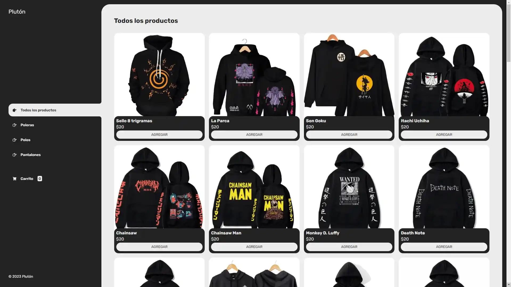
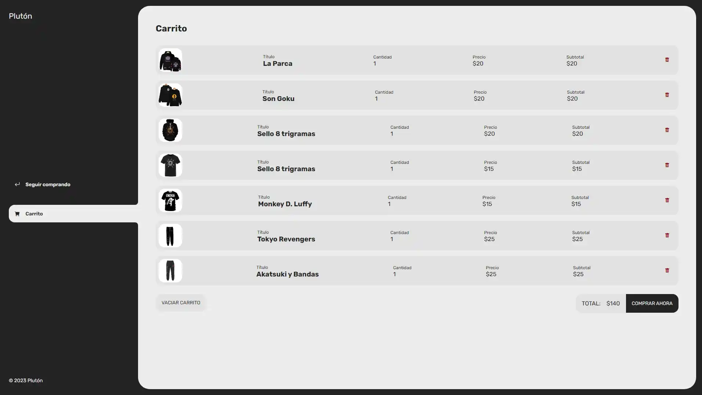
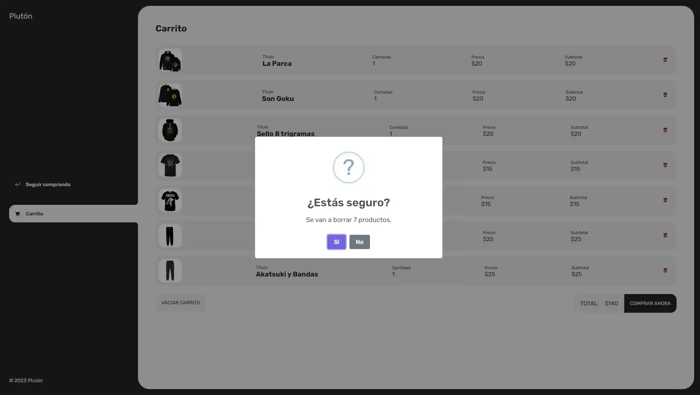

# TodoListPeruvian

¡Bienvenido al proyecto **Plutón/TiendaDeRopa**! Este es un proyecto de gestión de tareas realizado con **Node.js**, **React**, y **Vite**, enfocado en la usabilidad y la conectividad con una API backend. El objetivo principal es proporcionar a los usuarios una aplicación para gestionar y organizar sus tareas diarias de forma fácil y eficiente.

## Índice

- [Descripción del Proyecto](#descripción-del-proyecto)
- [Tecnologías Utilizadas](#tecnologías-utilizadas)
- [Caracteristicas](#caracteristicas)
- [Estructura del Proyecto](#estructura-del-proyecto)
- [Funcionalidades](#funcionalidades)
- [Uso](#uso)
- [Contribuyentes](#contribuyentes)
- [Licencia](#licencia)
- [Imágenes y Videos](#imágenes-y-videos)

## Descripción del Proyecto

**Plutón/TiendaDeRopa** es una tienda online de productos con la capacidad de mostrar diferentes categorías de productos, agregar productos al carrito, y realizar compras. La tienda está construida usando HTML, CSS, y JavaScript, y utiliza localStorage para almacenar el carrito de compras de manera persistente entre sesiones.


## Tecnologías Utilizadas

Este proyecto utiliza las siguientes tecnologías y herramientas:

- **HTML5:** Estructura de la página.
- **CSS3:** Estilos de la página.
- **JavaScript:** Lógica de la tienda y del carrito de compras.
- **JSON:** Datos de productos.

## Caracteristicas

Este proyecto utiliza las siguientes tecnologías y herramientas:

- **Pantalla principal:** Muestra los productos disponibles, que se pueden filtrar por categoría.
- **Categorías de productos:** Los productos están organizados en diferentes categorías (por ejemplo, poleras, polos, pantalones).
- **Carrito de compras:** Los usuarios pueden agregar productos al carrito, eliminar productos del carrito, vaciar el carrito y realizar compras.
- **Persistencia:** El carrito de compras se guarda en localStorage para que los productos se mantengan después de actualizar la página o cerrar el navegador.

## Estructura del Proyecto

La estructura del proyecto incluye los siguientes directorios principales:

```
└── 📁Tienda_De_Ropa
    └── 📁css
        └── main.css
    └── 📁img
        └── flork.png
        └── 📁pantalones
            └── 01.jpg
            └── 02.jpg
            └── 03.jpg
            └── 04.jpg
            └── 05.jpg
            └── 06.jpg
            └── 07.jpg
            └── 08.jpg
            └── 09.jpg
            └── 10.jpg
            └── 11.jpg
            └── 12.jpg
            └── 13.jpg
            └── 14.jpg
            └── 15.jpg
            └── 16.jpg
        └── 📁poleras
            └── 01.jpg
            └── 02.jpg
            └── 03.jpg
            └── 04.jpg
            └── 05.jpg
            └── 06.jpg
            └── 07.jpg
            └── 08.jpg
            └── 09.jpg
            └── 10.jpg
            └── 11.jpg
            └── 12.jpg
            └── 13.jpg
            └── 14.jpg
            └── 15.jpg
            └── 16.jpg
        └── 📁polos
            └── 01.jpg
            └── 02.jpg
            └── 03.jpg
            └── 04.jpg
            └── 05.jpg
            └── 06.jpg
            └── 07.jpg
            └── 08.jpg
            └── 09.jpg
            └── 10.jpg
            └── 11.jpg
            └── 12.jpg
            └── 13.jpg
            └── 14.jpg
            └── 15.jpg
            └── 16.jpg
    └── 📁js
        └── carrito.js
        └── main.js
        └── menu.js
        └── productos.json
    └── carrito.html
    └── index.html
    └── README.md
```

## Funcionalidades

Para comenzar a trabajar con TodoListPeruvian, sigue estos pasos:

### 1. Clonar el repositorio

Puedes clonar el proyecto en tu máquina local usando el siguiente comando:

```bash
git clone https://github.com/Hades0413/Tienda_De_Ropa.git
```

### 2. Cargar Productos

Los productos se cargan desde el archivo productos.json utilizando la función fetch. Esta función obtiene los datos y los pasa a la función cargarProductos para ser mostrados en la página principal.

```bash
fetch("./js/productos.json")
    .then(response => response.json())
    .then(data => {
        productos = data;
        cargarProductos(productos);
    });
```

### 3. Filtrar Productos por Categoría

El usuario puede seleccionar una categoría (por ejemplo, "Poleras", "Polos", etc.) y la página mostrará solo los productos de esa categoría. Al hacer clic en el botón de la categoría, se actualiza la lista de productos en el contenedor.

```bash
botonesCategorias.forEach(boton => {
    boton.addEventListener("click", (e) => {
        if (e.currentTarget.id != "todos") {
            const productosBoton = productos.filter(producto => producto.categoria.id === e.currentTarget.id);
            cargarProductos(productosBoton);
        } else {
            cargarProductos(productos);
        }
    });
});
```

### 4. Agregar Productos al Carrito

Cada producto tiene un botón para agregarlo al carrito. Al hacer clic en este botón, el producto se añade al carrito y se guarda en localStorage para persistencia. Si el producto ya está en el carrito, se incrementa su cantidad.

```bash
function agregarAlCarrito(e) {
    const idBoton = e.currentTarget.id;
    const productoAgregado = productos.find(producto => producto.id === idBoton);

    if (productosEnCarrito.some(producto => producto.id === idBoton)) {
        const index = productosEnCarrito.findIndex(producto => producto.id === idBoton);
        productosEnCarrito[index].cantidad++;
    } else {
        productoAgregado.cantidad = 1;
        productosEnCarrito.push(productoAgregado);
    }

    actualizarNumerito();
    localStorage.setItem("productos-en-carrito", JSON.stringify(productosEnCarrito));
}
```

### 5. Carrito de Compras

Los productos agregados al carrito se muestran en la página carrito.html. El carrito de compras permite al usuario eliminar productos, vaciar el carrito y realizar la compra.

°Eliminar producto: Al hacer clic en el botón de eliminar de un producto,  este se elimina del carrito y se actualiza el localStorage.

°Vaciar carrito: Se muestra una confirmación antes de vaciar todo el carrito.

°Realizar compra: Cuando el usuario hace clic en "Comprar ahora", se muestra un mensaje de agradecimiento y el carrito se vacía.

```bash
function vaciarCarrito() {
    productosEnCarrito.length = 0;
    localStorage.setItem("productos-en-carrito", JSON.stringify(productosEnCarrito));
    cargarProductosCarrito();
}

function comprarCarrito() {
    productosEnCarrito.length = 0;
    localStorage.setItem("productos-en-carrito", JSON.stringify(productosEnCarrito));
    contenedorCarritoVacio.classList.add("disabled");
    contenedorCarritoProductos.classList.add("disabled");
    contenedorCarritoAcciones.classList.add("disabled");
    contenedorCarritoComprado.classList.remove("disabled");
}

```


### 6. Menú Lateral en Móviles

En dispositivos móviles, el menú lateral se puede abrir y cerrar. El botón de menú abre el menú, y el botón de cierre lo cierra.

```bash
openMenu.addEventListener("click", () => {
    aside.classList.add("aside-visible");
});

closeMenu.addEventListener("click", () => {
    aside.classList.remove("aside-visible");
});

```

## Uso


### 1. Carrito de Compras

```bash
Clona el repositorio o descarga los archivos.
```

### 2. Carrito de Compras

```bash
Abre el archivo index.html en tu navegador para ver la tienda en funcionamiento.
```


## Contribuyentes

```bash
Eduardo Miguel Jaime Gomero
```

## Licencia

Este proyecto está bajo la Licencia MIT. Puedes usar, modificar y distribuir el código con fines personales o comerciales.

## Imágenes y Videos

### Imágenes:

A continuación, se muestran algunas imágenes del formulario de autenticación (AuthForm) y otras vistas relevantes:

1. 
2. 
3. 

Videos:
Demo del Proyecto:
Cómo ejecutar el Proyecto:

```

```
